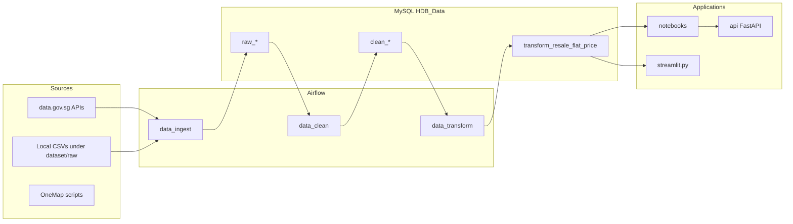

# HDB Price Estimator — System Architecture

This document describes how the repository is organized, how data flows, and what each major component does. It is intended for developers and AI assistants working on the project.

---

## High-level architecture

The system is an **end-to-end pipeline** for Singapore HDB resale price estimation:

1. **Ingestion** — Airflow loads raw data from data.gov.sg APIs and local CSVs into MySQL `raw_*` tables, with SHA-256 row fingerprints for integrity checks.
2. **Cleaning** — Airflow (optional path) normalizes raw tables into `clean_*` tables.
3. **Transformation / feature engineering** — Airflow joins geospatial and demographic sources to resale transactions and materializes **`transform_resale_flat_price`** (the main analytics / ML-ready table).
4. **Exploration & modeling** — Jupyter notebooks profile data, engineer features, and train models (e.g. ridge, random forest, XGBoost).
5. **Serving** — A **FastAPI** app loads a pickled model and exposes `/predict`; a **Streamlit** app visualizes `transform_resale_flat_price` and can approximate prices via similarity to historical rows.

**Central store:** MySQL database **`HDB_Data`** (configurable; see README and connection strings in code).

---

## Directory and component reference

| Path | Role |
|------|------|
| **`airflow/dags/ingest_dag.py`** | DAG **`data_ingest`**: `verify_data_integrity` → per-source `extract_*` → `watermark_*` → `upsert_*` into MySQL. |
| **`airflow/dags/helpers/dag_helpers.py`** | Source registry (`SOURCES`), extract/upsert/verify/watermark implementations; primary keys and API types. |
| **`airflow/dags/helpers/data_watermarking.py`** | Canonical JSON + SHA-256 fingerprints (`_fp`) for tamper detection. |
| **`airflow/dags/clean_dag.py`** | DAG **`data_clean`**: parallel tasks calling cleaners in `clean_dag_helpers`; writes `clean_*` tables. |
| **`airflow/dags/helpers/clean_dag_helpers.py`** | One cleaner per domain (HDB, MRT, POI, OneMap, carpark, bus, tourist attractions, resale flat price). |
| **`airflow/dags/transform_dag.py`** | DAG **`data_transform`**: task graph that joins ancillary data to resale rows then runs `transform_resale_prices`. |
| **`airflow/dags/helpers/transform_dag_helpers.py`** | SQLAlchemy + pandas joins (HDB, MRT, POI, OneMap, carpark, bus, tourist attractions), spatial helpers (e.g. BallTree), builds **`transform_resale_flat_price`** via temp table swap. |
| **`dataset/raw/`** | Versioned CSV inputs for ingest (HDB, MRT, bus, POI, OneMap exports, etc.). |
| **`dataset/processed/`** | Cleaned CSV derivatives (often notebook/script outputs); **gitignored** in `.gitignore`. |
| **`notebooks/`** | EDA, feature engineering, baseline models (LR, ridge+DT, RF+XGBoost), domain-specific cleaning EDA (carpark, tourist attractions, OneMap). |
| **`scripts/extract_onemap.py`** | Authenticates to OneMap API and pulls planning area, transport, tenancy, dwelling data into CSVs under `dataset/raw/` (run outside or beside Airflow). |
| **`scripts/clean_raw_data.py`** | Standalone SQLAlchemy cleaning utilities for OneMap-style tables (legacy/adhoc; overlapping concerns with `clean_dag_helpers`). |
| **`streamlit.py`** | Streamlit dashboard: reads **`transform_resale_flat_price`** from MySQL, map by month, nearest-neighbour style price estimate (scaled numeric + categorical penalty). |
| **`api/`** | FastAPI inference service: **`app/main.py`** (routes, lifespan), **`app/model.py`** (pickle load, `FEATURE_COLUMNS`, predict), **`app/schemas.py`** (Pydantic request/response aligned with model features). |
| **`api/models/`** | Placeholder for **`model.pkl`** (not committed); `MODEL_PATH` env override. |
| **`requirements.txt`** | Root Python deps: pandas, scikit-learn, Streamlit, Airflow providers, DB drivers, viz libs. |
| **`api/requirements.txt`** | API-specific deps (FastAPI, uvicorn, etc.). |
| **`.streamlit/config.toml`** | Streamlit UI configuration. |
| **`README.md`** | Setup, MySQL, Airflow config, ingest DAG behavior, data source table. |

---

## Data pipeline details

### Ingest (`data_ingest`)

- **Schedule:** `@daily` (see `ingest_dag.py`).
- **Pattern:** Upsert with `INSERT ... ON DUPLICATE KEY UPDATE` so fingerprints remain meaningful and downtime is reduced vs full refresh.
- **Sources:** Mix of data.gov.sg **poll-download** and **datastore_search**, plus local files under `dataset/raw/` (see README source table).

### Clean (`data_clean`)

- **Schedule:** `None` (manual trigger) by default; runs after raw data exists.
- **Output:** `clean_*` tables consumed by **`data_transform`**.

### Transform (`data_transform`)

- **Schedule:** `None` (manual).
- **Flow:** `joinable_resale_prices` → parallel joins (`join_hdb`, `join_mrt`, `join_poi`, `join_onemap`, `join_car_park`, `join_bus`, `join_tourist_attractions`) → `transform_resale_prices`.
- **Output:** **`transform_resale_flat_price`** — primary table for Streamlit and for training feature sets aligned with **`api/app/model.py`** `FEATURE_COLUMNS`.

---

## Machine learning and API contract

- **Training** happens in **`notebooks/`**; exported **`model.pkl`** must match the **ordered** feature list in **`api/app/model.py`** (`FEATURE_COLUMNS`).
- **`api/app/schemas.py`** `PredictRequest` fields must match `FEATURE_COLUMNS` exactly; startup asserts this in **`main.py`**.
- **Dummy mode:** If no model file exists, API returns a fixed placeholder price and `/health` reports `dummy`.

---

## Operational notes

- **`AIRFLOW_HOME`** and **`mysql_default`** connection must point at the same MySQL instance and schema as Streamlit/API expect.
- **`.gitignore`** excludes most of `airflow/` except whitelisted DAGs and `helpers/`, plus venv, logs, local DB files, and `dataset/processed/`.
- **Streamlit** uses hardcoded MySQL credentials in `streamlit.py`; production deployments should use secrets/env.

---

## Related documentation

- **`README.md`** — environment setup, Airflow, and ingest source list.
- **`api/README.md`** — running the API, Docker, endpoints, feature groups.
